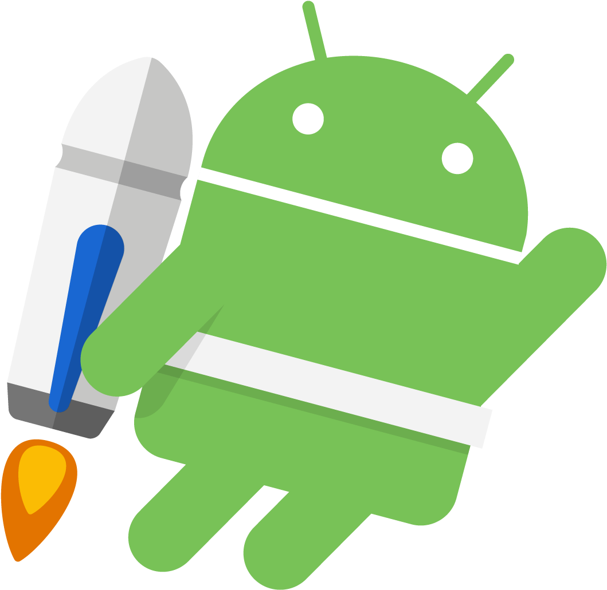
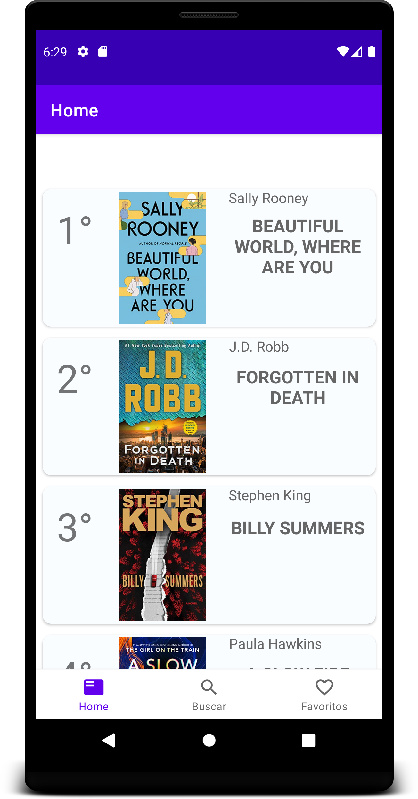
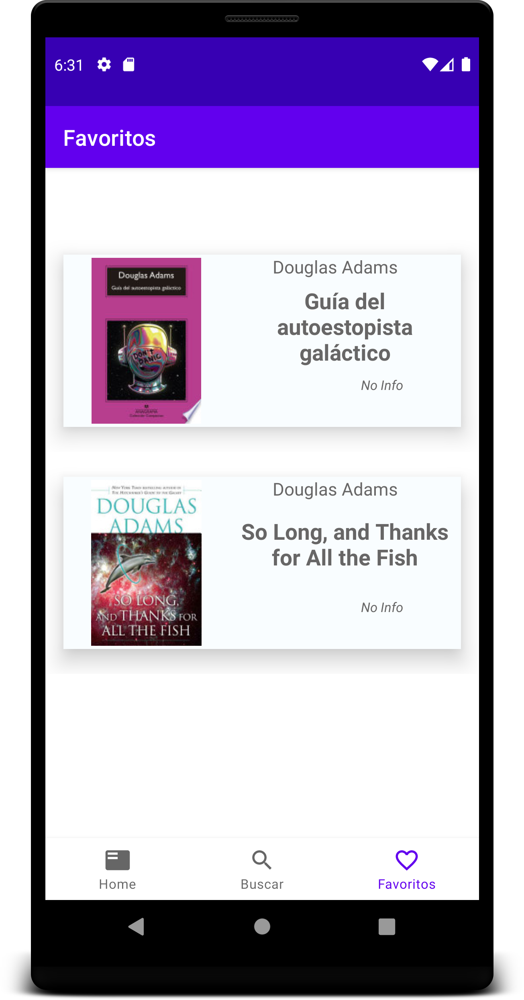
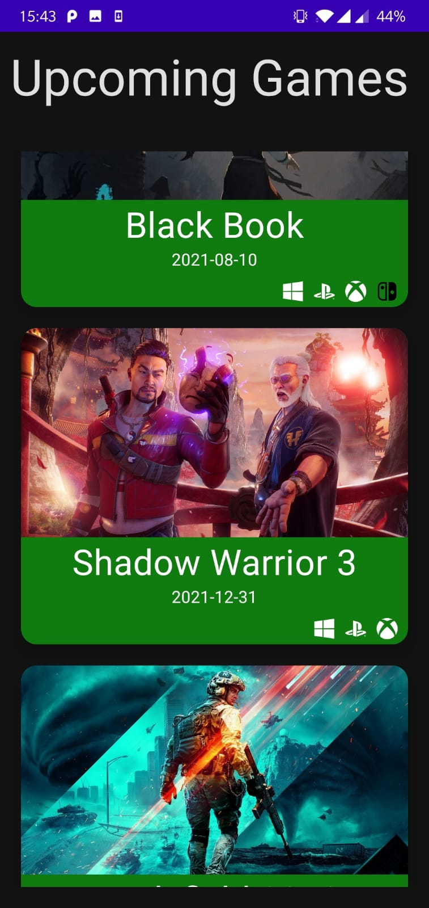
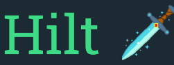
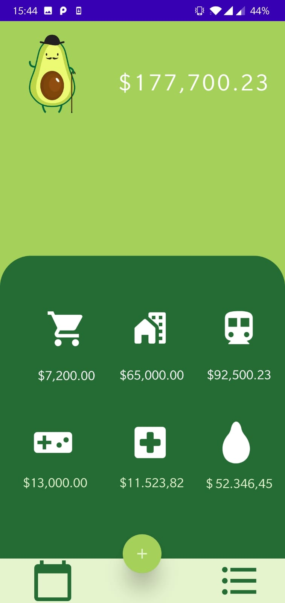
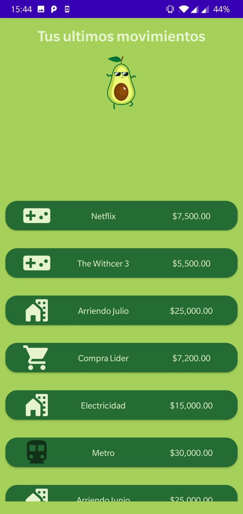
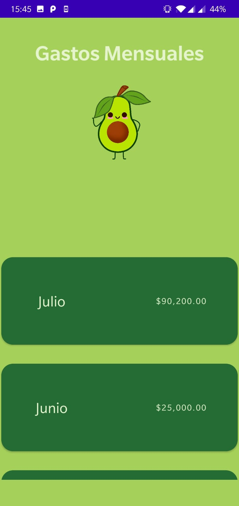
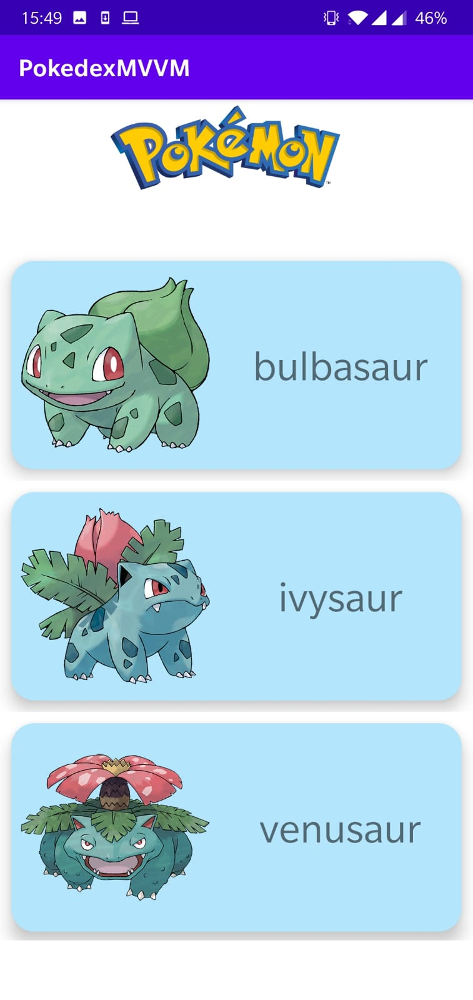
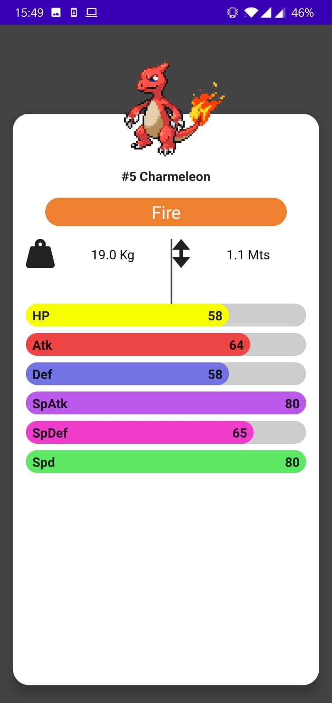

<h1 align="center">
Hi, I'm Ignacio Cavallo!
 
(CavIgna)
  </h1>
 
 

  

<samp>
I am a Commercial Engenier and Android Developer in progress.I am a creative, dedicated , goal-oriented individual, with exceptional communication skills, fluent in Spanish and English. I think that my business background is an assetin order to deeper comprehension of the needs of Companies.  

</samp>  

## 👨‍💻 Programming languages

&nbsp;&nbsp;
&nbsp;&nbsp;

 

## 💻 Software and tools

&nbsp;&nbsp;
&nbsp;&nbsp;
&nbsp;&nbsp;

 

## 🚀 FrameWorks

 

## 📊 Analytics and  AI

 

## 📱 Projects

<h3 align="center">NewssApp & RickAndMorty</h3>

 Both Apps consumes from an Api REST, and store the data in a database(Room). The source of truth is the repository, specifically  the DB. 

NewsApp         |  Rick and Morty App
:-------------------------:|:-------------------------:
|  
[News App](https://github.com/cavigna/RickAndMortyApp) |[Rick and Morty](https://github.com/cavigna/RickAndMortyApp)

&nbsp;
&nbsp;
&nbsp;&nbsp;
&nbsp;&nbsp;

<h3 align="center">BookFinder</h3>

This is an app that I bulit for searching and storing books. It uses <a href = "https://developers.google.com/books">Google Books API</a> for searching books by title or author, and <a href = "https://developer.nytimes.com/docs/books-product/1/overview ">NY Times API</a> for a list of bestsellers with the posibility of storing your favorite books in a database for offline conections(with images in room db).  

Link to Repo: [Book App](https://github.com/cavigna/BooksApp/tree/UI)

 

&nbsp;&nbsp;&nbsp;&nbsp;&nbsp;
&nbsp;

 

<!--  -->

&nbsp;
&nbsp;
&nbsp;&nbsp;
&nbsp;&nbsp;

 

<h3 align="center">Games App</h3>

Is an App in progress. The data comes from [Rawg API](https://api.rawg.io/) fetching upcoming games and also, best games of the year. Developed with *Jepack Compose* from the ground,  RetroFit, MVVM Architecture, Kotlin Coroutines, Dagger Hilt for Dependency Injection, and Jetpack Navigation Component.  

Link to Repo: [Games App](https://github.com/cavigna/GamesApp)

 

&nbsp;&nbsp;&nbsp;&nbsp;&nbsp;

 

&nbsp;
&nbsp;&nbsp;
&nbsp;&nbsp;
&nbsp;&nbsp;

 
 

<h3 align="center">PaltApp</h3>

It's a simple expenses tracker. Coded in java, with MVVM,  Room, and a lot of Kawaii!!. This was my first full app in Android, after almost two months of learning App development in java.

Link to Repo: [PaltApp](https://github.com/cavigna/Android_Development/tree/main/PaltApp)

 

&nbsp;&nbsp;&nbsp;&nbsp;&nbsp;
&nbsp;&nbsp;&nbsp;&nbsp;&nbsp;
&nbsp;&nbsp;&nbsp;&nbsp;&nbsp;

 

&nbsp;
&nbsp;

 

<h3 align="center">PokeDex</h3>
 

Just for fun i followed a [tutorial](https://www.youtube.com/watch?v=v0of23TxIKc&list=PLQkwcJG4YTCTimTCpEL5FZgaWdIZQuB7m), but on my own terms. Because if you code along you don't learn much, so I mixed everything up, in order to learn by my self how can interact the old way with the new way. So, the Main Activity is the traditional way, with RecyclerView and textview, so on , so for; in the other hand,  Details Activity, it's made enterly with Jetpack Compose.  Beside compose, uses MVVM, Retrofit, LiveData and Coroutines.

Link to Repo: [PokeDex](https://github.com/cavigna/Pokedex)

 

&nbsp;&nbsp;&nbsp;&nbsp;&nbsp;
&nbsp;&nbsp;&nbsp;&nbsp;&nbsp;

 

&nbsp;
&nbsp;&nbsp;
&nbsp;&nbsp;

 

 

 

## 🔥   Stats

  
  

 
 

   <a href="https://github.com/ashutosh00710/github-readme-activity-graph"> 
   
   
   
 -->

 

<!--
**cavigna/cavigna** is a ✨ _special_ ✨ repository because its `README.md` (this file) appears on your GitHub profile.

Here are some ideas to get you started:

- 🔭 I’m currently working on ...
- 🌱 I’m currently learning ...
- 👯 I’m looking to collaborate on ...
- 🤔 I’m looking for help with ...
- 💬 Ask me about ...
- 📫 How to reach me: ...
- 😄 Pronouns: ...
- ⚡ Fun fact: ...

<samp>
I am a creative🎡, time punctual👩‍🎓, dedicated🎯, goal-oriented individual👩‍💻 with decent moral Values and Ethicates🙇‍♀️ along with a high-energy level🤹‍♀️, honed communication skills👐, strong organizational skills👮‍♀️, and meticulous attention🕵️‍♀️ to detail.
</samp>
-->
